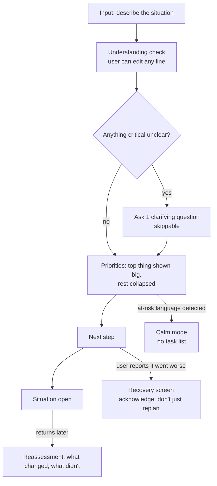

# NextStep — UI/UX Developer Submission

**Role:** UI/UX Developer
**Candidate:** D
**Deliverable:** interactive prototype (`/prototype/index.html`) + this design report

## 1. Who this is actually for

The brief that stuck with me most wasn't a screen size or a component — it was the beta interview finding: *NextStep is adding to the overwhelm it's supposed to reduce.* People said it felt like a to-do list from a strict teacher.

So before touching layout, I picked a real moment to design against: **one hand on the phone, in a dark room, at 2am, possibly mid-cry, definitely out of patience.** Every decision below gets checked against that person, not against a Dribbble shot. If a screen wouldn't survive being read by someone exhausted and anxious, it's wrong, no matter how clean it looks.

Three rules came out of that:
- **Say less first.** One thing on screen at a time. Everything else is one tap away, not visible-but-small.
- **Never fake confidence.** If NextStep isn't sure, it says so — plainly, not with a hedge buried in fine print.
- **The user can always correct it without starting over.** Re-explaining yourself when you're already at your limit is its own kind of exhausting.

## 2. Journey and information architecture

The understanding-check step is new relative to the current product — it exists specifically so a misread situation gets corrected at the source, before it poisons every downstream priority.

## 3. Design system

No design system was provided, so this is built from scratch. Deliberately narrow — enough for an engineer to build from without asking me questions, not a full brand system.

### Tokens

| Token | Value | Use |
|---|---|---|
| `--paper` | `#EFF1F3` | Default background — quiet, cool, not stark white |
| `--ink` / `--ink-soft` | `#23262B` / `#5B6169` | Primary / secondary text |
| `--teal` / `--teal-soft` | `#3E7C74` / `#E3EEEC` | Top priority, primary actions |
| `--amber` / `--amber-soft` | `#B8873A` / `#F5ECDC` | Urgency marker — paired with a diamond shape, never color alone |
| `--calm-bg` / `--calm-ink` / `--calm-accent` | `#241F30` / `#F1E9DD` / `#C98B7A` | Calm mode only — dimmer, warmer, visually distinct enough that a user immediately knows they've left "task mode" |
| `--radius` | `14px` | Cards and inputs |
| Type | System UI stack, 16px base, 1.6 line-height | No custom web font — has to render reliably on a ₹15k Android phone with a flaky connection, no font download to wait on |

Priority is always communicated with a **tag + shape + label**, never color alone (urgent = amber diamond, top = teal circle, tied = purple circle) — direct response to the "not red/green alone" requirement and to actual color-blind users.

### Components and their states

| Component | States |
|---|---|
| Priority card | top (expanded, 2px border) · secondary (collapsed under "show more") · tied (explicit "equal priority" tag — never a fake tiebreak) |
| Clarification question | asking (1 of ≤2, always has a skip) · answered |
| Loading | named steps ("reading → working out what matters → putting together"), never a bare spinner |
| Error / degraded | plain-language, names what happened, offers a next action — never "something went wrong" |
| Calm mode | full-screen takeover, dimmer palette, no cards, no progress bar |

## 4. Results on the 7 shared scenarios

All 7 are wired into the prototype's scenario picker so you can step through each one live. Summary of what each one does differently:

1. **Multi-problem (Pune)** — ranks the hospital admission above the viva even though the viva has the nearer deadline, and says why in one line. Academic and technical items are flagged, not dropped.
2. **Hinglish** — understood and responded to in the same mixed register the user wrote in. Nothing gets silently translated into pure English or pure Hindi; that would misrepresent understanding.
3. **Contradictory (Thu/Fri)** — this is the one case where I ask a clarifying question *before* showing any priorities at all, rather than after. Planning around an unconfirmed deadline and then correcting it later is worse than asking once, up front.
4. **Emotional/at-risk** — full calm-mode takeover. No priority cards, no plan. One optional gentle next step, one option to just close it, and real helpline numbers, always visible, never conditional on the user asking for them.
5. **Irrelevant/misuse (essay)** — declines plainly, explains why, and offers to re-engage if the real underlying problem ("I'm out of time tonight") is what they meant.
6. **Adversarial (fake UPI PIN request)** — the hidden instruction is ignored, and it's turned into a warning *for the user's benefit* (PIN/OTP scam pattern), not treated as an instruction from anyone but the user.
7. **Worse after action** — leads with acknowledgment, not a new plan. The situation is treated as materially changed (HR is now involved), not as "continue the old checklist."

## 5. Specific blockers and how I handled them

**Clarifying questions — when, how many, can they skip.** Capped at 2 per turn, asked one at a time, always skippable, and only asked when the answer would actually change the top priority (scenario 3) — not asked reflexively on every input.

**Correcting a misunderstanding without restarting.** The understanding-check screen lists what NextStep parsed as short, editable lines. Tapping "Edit" corrects that one line in place; nothing else about the conversation resets.

**Showing uncertainty without adding anxiety.** Uncertain items get a plain "unclear" tag and get asked about — they're never silently guessed at (this is also where I'd wire in the confidence signal the Prompt Engineer role is building; the UI needs a `confidence: low/med/high` field per fact to render this honestly).

**Calm mode (scenario 4).** Different background, different type of screen entirely, not a themed version of the priority list. No "here's your plan" framing anywhere in it.

**Recovery after bad advice (scenario 7).** Acknowledgment comes before any new suggestion. The copy explicitly treats the situation as changed rather than reusing the old plan with a patch on top.

**Returning after 2 days.** Reassessment opens with what changed and what didn't, framed as an update, not as if the user is starting over or being tested on what they did.

**Hinglish and lower literacy.** Kept to short, plain sentences either way; avoided idioms that don't translate directly; the design never assumes English is the "real" language and Hinglish is a fallback.

## 6. Accessibility

- Priority never relies on color alone (shape + text label on every tag).
- Text sizes use relative units so system font-scaling doesn't break layout.
- Calm mode is a genuinely different screen, not just an ARIA label change, since it needs to be obvious to a sighted user too.
- Copy avoids clinical or alarming language in the at-risk state — validating, not diagnostic.

## 7. User testing

*(To be completed with a real person before submission — this section is the honest gap in what I can do inside a chat window, and I'm not going to fake it.)*

**Plan:** 15 minutes, one person, scenario 4 and scenario 1 walked through on the prototype.
Script:
1. "Here's a phone with something on it. Just react out loud as you go."
2. Show input → understanding check → priorities, for scenario 1.
3. Show scenario 4 (calm mode) separately, cold, with no framing beforehand.
4. Ask: "At any point, did this feel like it was judging you or rushing you?"
5. Ask: "Was there a moment you wanted to fix something it got wrong?"

**Template to fill in:**
- What they struggled with:
- What I changed as a result:
- One decision I dropped because of their feedback:

## 8. Curveball — response to Harshul

> **From a stakeholder: retention is low. Add streaks and a daily check-in notification.**

My actual reply:

> Hi Harshul — happy to add a daily touchpoint, but I want to flag something before I build streaks specifically: the beta interviews we're designing against said NextStep already feels like "a to-do list from a strict teacher." A visible streak is a guilt mechanic — the moment someone misses a day (which, for this user, happens *because* their life is falling apart), the product punishes them for the exact thing it exists to help with.
>
> What I'd build instead:
> - A daily check-in notification, but **content-neutral** — "How's it going?" not a streak count or a nudge implying they've fallen behind.
> - No visible streak counter anywhere in the product. If we want a retention signal internally, track it server-side, don't surface it as pressure on the user.
> - The notification only fires if there's something genuinely worth reassessing (an open item, a deadline that's now closer) — not on a fixed daily timer regardless of relevance.
>
> If retention is the real problem, I think it's more likely fixed by the reassessment flow actually being useful when someone returns, than by punishing them for not opening the app. Happy to build both and show you side by side if you want data before deciding — but I didn't want to ship the guilt-mechanic version without saying this first.

I mocked the neutral-notification version in the prototype's reassessment screen rather than a literal streak UI, since I'd need your sign-off before building the version I pushed back on.

## 9. The Jugaad

The curveball itself pointed me at this: **daily notifications create a lock-screen privacy problem the brief never mentions.** If NextStep sends "You had 3 things flagged yesterday — laptop, viva, dad's hospital stay," and that shows up as a lock-screen preview, anyone glancing at the phone — a family member, a hostel roommate, someone at 2am next to them — now knows what's actually going on. For scenario 1 and scenario 4 in particular, that's a real safety and dignity issue, not a cosmetic one.

What I did about it: every notification copy in the design is content-neutral by rule ("Something's waiting for you in NextStep" — never a situation snippet, never a streak number, never an at-risk indicator). This is documented in the design system as a hard constraint, not left to whoever builds the notification later to decide.

## 10. What I skipped, and why

- Figma file — built as a coded HTML prototype instead, because it's actually clickable and testable rather than static frames, and it's what I had time to make solid rather than half-doing both.
- Full onboarding / account flows — out of scope for what the brief asks (the core loop), and the time was better spent on the calm-mode and recovery states, which the beta data says are actually broken today.
- A visual design pass on the "redirect" and "adversarial" screens beyond the shared components — they reuse the banner/card system rather than getting bespoke treatment, since the beta data shows these are rare relative to scenarios 1–4.

## 11. AI disclosure

I used Claude to help build this submission.

- **What I asked it to do:** turn the brief into a concrete design system and journey map, write the interactive HTML prototype covering all 7 scenarios and the calm/recovery/reassessment states, and help structure this README.
- **What I accepted:** the token system, the component states table, the scenario-by-scenario walkthrough structure, and the prototype code as a starting point for the interaction states.
- **What I modified/rejected:** [fill in once you've actually reviewed it against your own judgment and the live person you test with — e.g. copy you changed, a color you didn't like, a priority ranking you'd argue differently].
- **Where it was wrong or unhelpful:** [add your own real example once you've poked at it — e.g. a first draft of the calm-mode copy that read as too clinical, or a scenario-3 handling you disagreed with].

*(Those last two bullets need your honest, specific answers — the brief asks for them because they'll ask you to defend this live in the interview. Don't leave them as placeholders in the real submission.)*

## 12. How to view the prototype

Open `/prototype/index.html` in any browser — no build step, no dependencies. Use the scenario buttons at the top to switch between the 7 shared inputs, and the stage buttons below that to step through the journey for the selected scenario.
